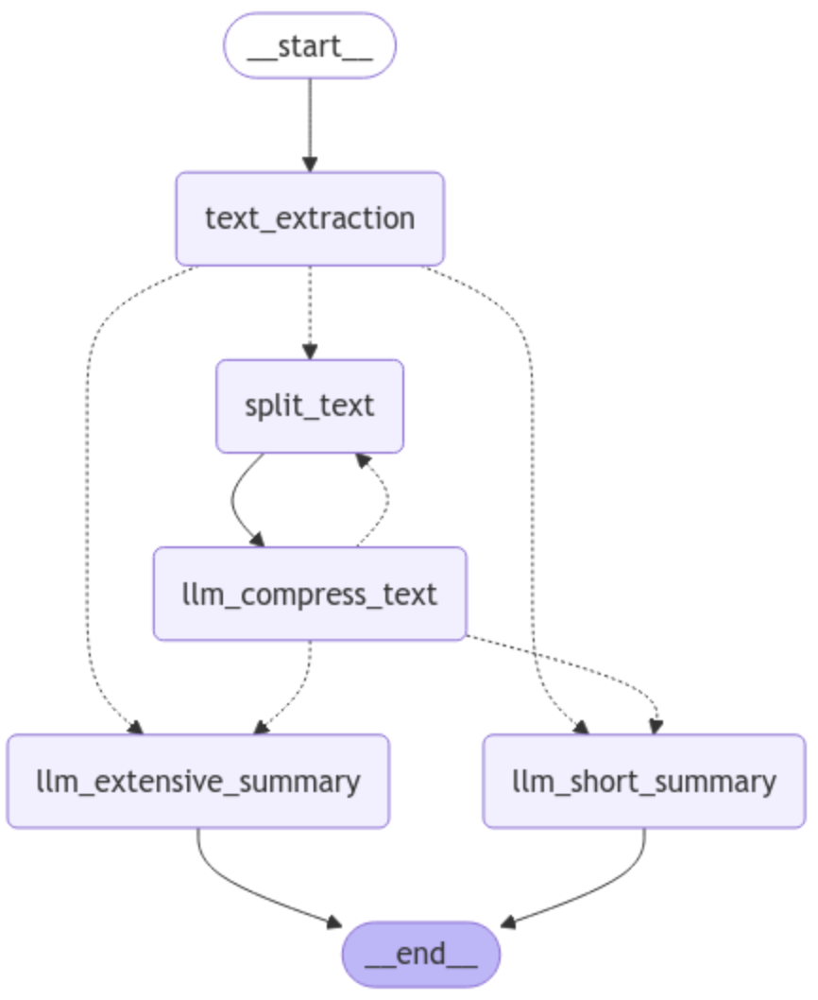

# FastReader

FastReader is an application designed to process and summarize documents. Text compression is happening in an iterative manner, enabling fastReader to compress even huge documents or books into a few sentences.


## Installation

To set up the environment:

```sh
make env-create
```

## Ollama Installation

Ollama is required for running local language models. To install Ollama, follow the instructions on the [Ollama GitHub page](https://github.com/ollama/ollama).

## Usage

To run the application, use the following command:

```sh
python src/run.py --URL https://www.zenml.io/blog/production-llm-security-real-world-strategies-from-industry-leaders --document_type text
```

There are three types of documents that can be processed:
- youtube videos: `youtube` - https://www.youtube.com/watch?v=gF341XMN8cY
- pdfs: `pdf` - https://arxiv.org/pdf/2501.04227
- text: `text` - https://www.zenml.io/blog/production-llm-security-real-world-strategies-from-industry-leaders